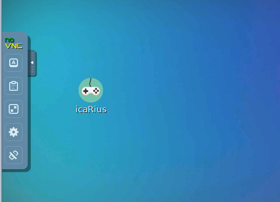

# Démarrage rapide

## Comment jouer \(et se former\)?

L'aventure vidéoludique que nous vous proposons de suivre via le Funcamp R se compose de **deux éléments** :

* **un jeu vidéo** \(oui, comme quoi, on peut jouer pendant qu'on travaille\)   
* **des tutoriels R** \(oui, comme quoi, on peut se former pendant qu'on joue\).

Pour le Funcamp, il vous faudra utiliser les deux environnements. Ces derniers peuvent soit être installés directement sur votre poste de travail, soit être utilisés en ligne.

Nous allons vous guider pour accéder à ces éléments.

## Installer le jeu icaRius sur votre poste...

> ### Simple et rapide !

Vous pouvez tout d'abord télécharger le jeu sur votre poste de travail, ou sur une clef USB : c'est rapide et léger \(seulement 30 mo, moins de 5 minutes\). Rien à craindre pour la sécurité de votre poste - d'ailleurs, c'est une version dite "portable" du jeu, qui n'installe rien sur votre système d'exploitation. Voici comment procéder :

* téléchargez le jeu icaRius en cliquant sur [le lien ici](https://minio.lab.sspcloud.fr/lxwgkb/icaRius-windows.zip)
* le fichier téléchargé s'appelle : icaRius-windows.zip
* dézipper le contenu à l'endroit de votre choix \(par exemple, dans "Mes documents", ou même sur une clé USB\) : vous aurez alors un répertoire appelé icaRius-windows.
* à la fin de l'installation, allez dans le répertoire icaRius-windows, puis double-cliquez sur l'icône **START\_icarius**, qui lancera automatiquement une page d'accueil. 
* La page d'accueil comporte une introduction et le lien vers le jeu : **laissez-vous guider** ! 



## Suivez les tutoriels R sur votre navigateur Internet

> ### Explorez le funcamp en ligne sur le SSPCloud. C'est l'idéal pour les tutoriels !

* Accédez via votre navigateur Internet, sur la plateforme SSPCloud pour vous inscrire sur [datalab.sspcloud.fr](https://onyxia.lab.sspcloud.fr)

* Ouvrez le **menu** pour accéder **au catalogue de formation**

* Sélectionnez le parcours **Funcamp R.**

* Le dossier est composé de toutes les étapes du parcours : le jeu icaRius d'abord et un item pour chaque chapitre du grimoire \(chaque tutoriel\). Pour lancer un tutoriel depuis votre navigateur Internet, cliquez sur le chapitre correspondant avec l'icone en forme d'engrenage.

* Dans le panneau qui s'ouvre, cliquez simplement sur "créer votre service"  

* Patientez pendant les quelques secondes de chargement. Une fois cette étape achevée, ouvrez le grimoire en cliquant sur l'icone en forme de fléche. **Attention** : même si le grimoire semble disponible, il faut le plus souvent attendre 40 à 50 secondes de plus pour qu'il soit effectivement accessible sur Internet. Ne soyez pas inquiet de voir, au début, un message d'erreur indiquant que le service n'est pas disponible \(patience...\).

* Pour lancer les autres tutoriels à chaque étape du jeu, reproduisez la même démarche pour chaque chapitre du grimoire.

## Une autre méthode : jouer à icaRius en ligne 🔇 \(pour les utilisateurs avancés\)

Cette méthode est une solution de secours par rapport au téléchargement du jeu sur votre poste. En effet, en ligne, vous pourrez avoir des ralentissements, et vous ne pourrez pas profiter de la musique du jeu ! Snif...

Voici néanmoins le mode opératoire :

* Accédez via votre navigateur Internet, sur la plateforme SSPCloud pour vous inscrire sur [datalab.sspcloud.fr](https://onyxia.lab.sspcloud.fr)
* Ouvrez le **menu** pour accéder **au catalogue de formation** et sélectionnez **Funcamp R.**
* Le dossier est composé de toutes les étapes du parcours : le jeu icaRius d'abord et un item pour chaque chapitre du grimoire \(chaque tutoriel\)
* Pour lancer le jeu icaRius depuis votre navigateur Internet, cliquez sur le jeu 

* dans le nouveau panneau, cliquez sur "créer votre service".

* Pendant les quelques secondes de chargement, copiez votre mot de passe d’accès aux services à partir de l’icône en forme de clef.

* Il ne reste qu’à lancer le jeu dans votre navigateur internet, en cliquant sur l'icône avec une flèche et de coller votre mot de passe

* Dans cet environnement virtuel, double-cliquez sur l'icône du jeu icaRius, et jouez !

* Bon, c'est beaucoup plus simple à faire qu'à lire - la preuve en vidéo :



## Encore une autre méthode : installer le jeu et les tutoriels \(ensemble\) sur votre poste \(pour les utilisateurs avancés\)

> ### Attention, il faut de la place : près de 2 Go ! Cette méthode vous permet d'avoir toutes les ressources, ludiques et pédagogiques, directement sur votre poste de travail ou sur une clef USB.

* Téléchargez le grimoire et le jeu [en cliquant ici](https://minio.lab.sspcloud.fr/funcampr/funcampr-allinone.zip) \(Le fichier téléchargé s'appelle : funcampr-allinone.zip\)
* ça va prendre un peu de temps : patience \(environ 500 mo à télécharger\)
* Dézippez le contenu à l'endroit de votre choix : vous aurez alors un répertoire appelé funcampr-allinone. 
* il faut un peu de place, désolé pour l'encombrement \(1,5 go environ\)
* À la fin de l'installation, allez dans le répertoire funcampR, puis double-cliquez sur l'icône **START\_grimoire**, qui lancera automatiquement une page d'accueil. 
* La page d'accueil comporte le lien vers chaque chapitre du grimoire, et aussi vers le jeu : **laissez-vous guider** ! 



_Attention, il faut veiller à ce que le chemin d'installation de votre répertoire ne comporte pas d'espace blanc. Par exemple, F:\MonRepertoire\funcampr fonctionnera, mais pas F:\Mon Repertoire\funcampr_

